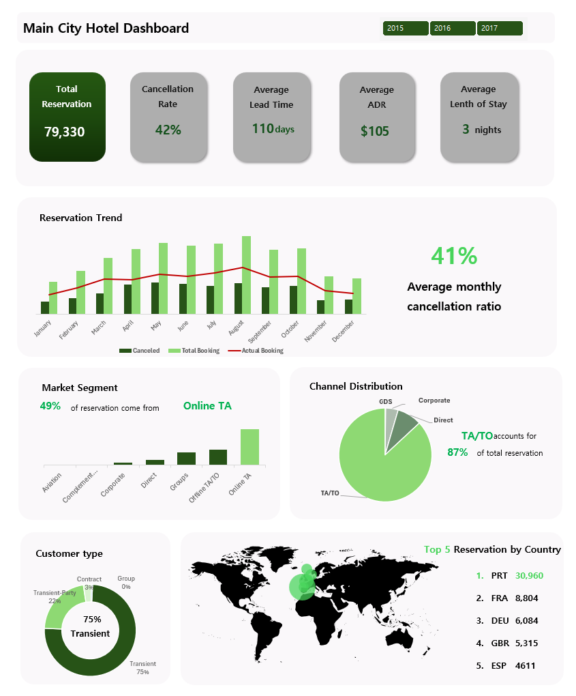
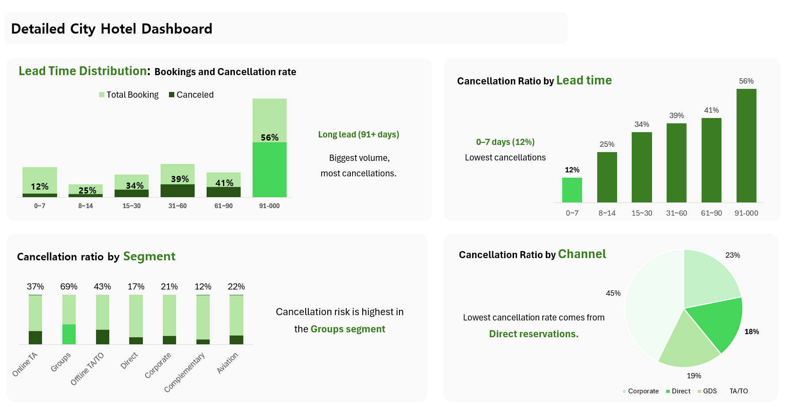

# 🏨 City Hotel Booking Cancellation Analysis


## 📌 Project Description
This project analyzes hotel booking cancellations using the **Hotel Booking Demand Dataset** from Kaggle.  
I focused on the **City Hotel** subset (66% of all records) because it has the majority of bookings.  
The goal was to **understand cancellation patterns** and provide insights to **reduce cancellations** and **maximize revenue**.  

## 📊 Dataset
- **Source:** [Hotel bookings demand – Kaggle](https://www.kaggle.com/datasets/jessemostipak/hotel-booking-demand)  ](https://www.kaggle.com/datasets/qucwang/hotel-bookings-analysis-dataset)
- **Records:** ~119k bookings (after cleaning)  
- **Hotels:** Resort Hotel (H1), City Hotel (H2)  
- **Fields used:**
  - `hotel`
  - `is_canceled` → booking canceled (1) or not (0)  
  - `lead_time` → days between booking date and arrival  
  - `arrival_date_year`, `arrival_date_month`  
  - `market_segment`, `distribution_channel`
  - `lead_time`
  - `country`
  - `adr`
      

All personal data was removed by dataset authors.

---

## 🛠 Tools & Methods
- **Excel Power Query** → Data import, cleaning, transformation (removing unnecessary rows/columns, fixing values).  
- **DAX & PivotTables** → Calculated measures, dynamic percentages, ratios.  
- **Slicers** → Enabled year-based filtering (2015, 2016, 2017).  
- **Dashboarding in Excel** → Designed both *Main Dashboard* (executive overview) and *Detailed Dashboard* (drill-down).  

---

## 📈 Main Dashboard (Executive Overview)


### KPIs
- **Total Reservations:** 79,330 bookings (City Hotel subset).  
- **Cancellation Rate:** 42% overall.  
- **Average Lead Time:** 110 days.  
- **ADR (Average Daily Rate):** $105.  
- **Average Length of Stay:** 3 nights.  

### Cards & Trends
- **Reservation Trend (Jan–Dec):**  
  Cancellations peaked in April–June, while booking volumes were highest in summer (July–August).  

- **Average Monthly Cancellation Ratio:**  
  ~41% cancellations each month, indicating a structural issue.  

- **Market Segment:**  
  - 49% of bookings come from **Online TA** (online travel agencies).  
  - OTA-driven business dominates but is also riskier.  

- **Channel Distribution:**  
  - **TA/TO (Travel Agent/Tour Operator):** 87% of all reservations.  
  - Heavy dependence on intermediaries limits direct revenue control.  

- **Customer Type:**  
  - 75% of bookings are **Transient** (individual guests).  
  - Contract and group bookings are minimal.  

- **Top 5 Reservations by Country:**  
  - **Portugal (PRT):** 30,960  
  - **France (FRA):** 8,804  
  - **Germany (DEU):** 6,084  
  - **UK (GBR):** 5,315  
  - **Spain (ESP):** 4,611  

**Key Insight:**  
The hotel is highly dependent on **OTA bookings** with a very high **42% cancellation rate**, particularly during long lead times and OTA-driven reservations.  

---

## 📊 Detailed Dashboard (Drill-Down Analysis)


### Lead Time Analysis
- **91+ Days:** Largest share of bookings and **highest cancellations (56%)**.  
- **0–7 Days:** Lowest cancellation risk (**12%**).  
- **Insight:** Long lead time bookings are risky; last-minute bookings are stable.  

### Segment Analysis
- **Groups:** Highest cancellation ratio (**69%**).  
- **Online TA:** 37% cancellations, high volume.  
- **Direct & Corporate:** Relatively low cancellation risk (17–21%).  
- **Complementary:** Only 12% cancellations (most stable).  

### Channel Analysis
- **Direct Reservations:** Lowest cancellation rate (most reliable).  
- **TA/TO:** High share of bookings but higher risk.  

**Key Insight:**  
- **Groups + OTAs** drive most cancellations.  
- **Direct bookings** are the most reliable channel.  
- **Policy Recommendation:** Implement stricter cancellation rules or deposit requirements for long-lead OTA and group bookings.  

---

## 🚀 Conclusions
- **42% cancellation rate** is a serious revenue leakage issue.  
- **91+ day lead time bookings** are unstable and should be managed with stricter policies.  
- **Groups** and **OTA channels** represent the riskiest segments.  
- **Direct and corporate bookings** are stable and should be encouraged.  

---


## 🔧 Recommendations for the Hotel

Based on the analysis (42% overall cancellation rate, high risk from long lead time, OTA and Group segments), the following actions are advised:

1. **Stricter Cancellation Policies for Long Lead Times**  
   - Require deposits or non-refundable rates for bookings made **91+ days in advance**.  
   - Implement tiered cancellation windows (e.g., free up to 30 days, partial charge 30–7 days, full charge <7 days).  

2. **Negotiate with OTAs to Reduce Free Cancellation Windows**  
   - Many OTA-driven bookings (37–43% cancellation rate) are speculative.  
   - Negotiate shorter free-cancellation windows or promote prepaid/non-refundable OTA rates.  

3. **Focus on Direct Bookings**  
   - Direct channel had the **lowest cancellation ratio**.  
   - Incentivize direct booking with benefits (discounts, free breakfast, loyalty points) to shift dependence away from OTAs.  

4. **Group Booking Guarantees**  
   - Groups showed the **highest cancellation ratio (69%)**.  
   - Require group contracts to include cancellation clauses, deposits, or staged payments to reduce last-minute dropouts.  

5. **Revenue Management Strategy: Overbooking Buffer**  
   - With historically high cancellations, controlled **overbooking** can recover lost revenue.  
   - Use historical cancellation data (lead time + segment patterns) to set safe overbooking limits.  

---

## 🚀 Key Takeaways
- **Cancellations are structural (42%)**, not seasonal noise.  
- **Long lead time + OTA + Groups = biggest risk areas.**  
- **Direct & corporate guests = most reliable revenue sources.**  
- By enforcing stricter rules and shifting booking mix, the hotel can **reduce cancellations and stabilize cash flow**.

- 


> Exploratory analysis of City Hotel cancellations using the Kaggle Hotel Booking Demand dataset.  
> Built with **Excel Power Query + DAX + PivotTables**, featuring dual dashboards (Main & Detailed) to uncover patterns in lead time, segments, and channels.  
> Focus: **Reduce cancellations and maximize revenue stability**.  


## 📂 Repository Structure
```plaintext
.
├── city_hotel_analysis.xlsx     # Processed dataset with transformations
├── Main.png                     # Executive (Main) dashboard
├── detail.png                   # Detailed dashboard
├── README.md                    # Project documentation
